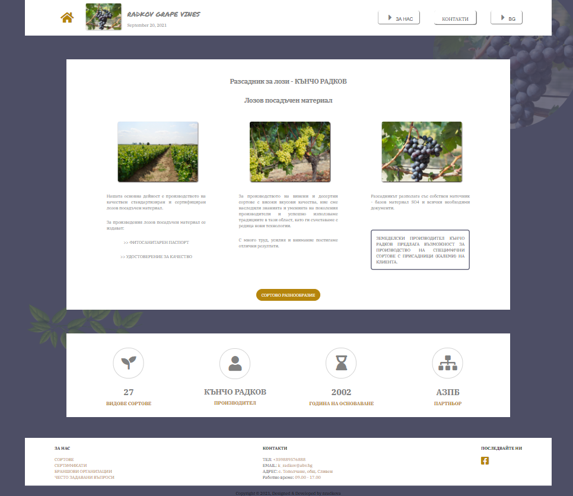

# GRAPE-VINES

[https://grape-vines.github.io/](https://grape-vines.github.io/)

## A simple SPA project created for JS Applications course

* GRAPE-VINES is a landing page for a grape vines' nursery, which provides basic bussiness information about the organization - products, certificates, contacts, geo location, etc. 
* Users can experience custom search of products by name, by type or both. Direct communication with the nursery is also provided. 

## Technologies used:
* HTML, CSS, Javascript
* page, lit-html
* Leaflet
* GitHub Pages, Back4app

